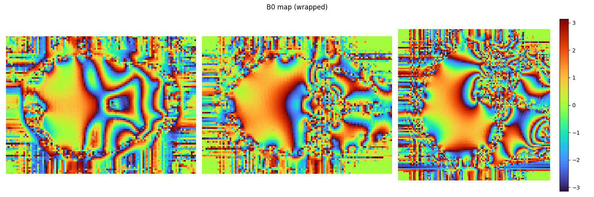
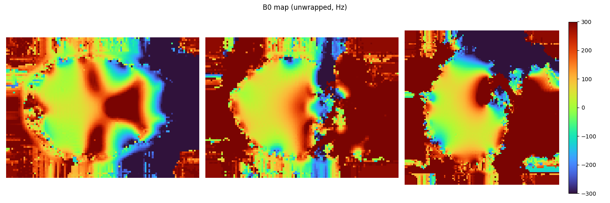
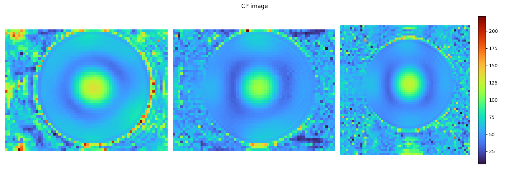
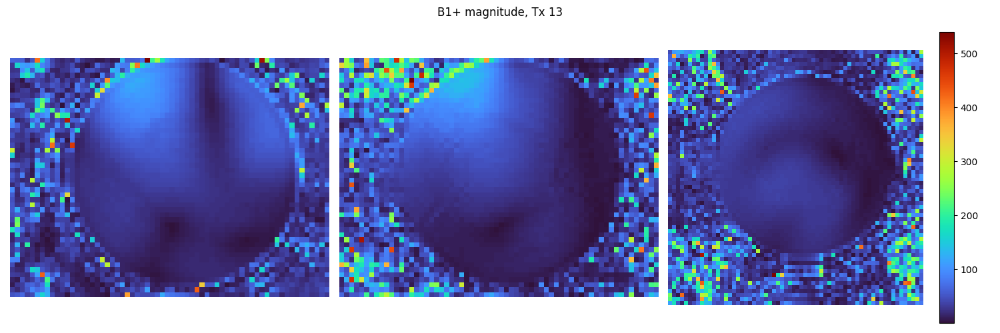

recotwix comprises a set of utilities for reconstructing MR images from Siemens rawdata files (.dat).
The goal is to offer distinct Python scripts (classes) for reconstructing various sequence types. These classes inherit from 'recotwix', the parent class, which furnishes fundamental reconstruction routines and several general utilities.

### Requirments

recotwix uses [twixtools](https://github.com/pehses/twixtools) for raw data reading purposes. It has undergone testing and validation with Python 3.10.
Other packages needed:
 - numpy 
 - torch 
 - scipy
 - nibabel 
 - tqdm
 
recotwix also employs [BART](https://github.com/mrirecon/bart) for coil sensitivity calculation and combination. 

###  Installation
open terminal and simply navigate to the recotwix and install it with pip:

    pip install .

### Demo
The provided examples showcase the reconstruction of a B0 map derived from a double-echo GRE sequence and a B1+ map from a [ 3D satTFL](https://doi.org/10.1002/mrm.29459) sequence.


```python
%matplotlib widget
from recoB0 import recoB0
from pytools import plot

filename = '/DATA2/rawdata/twixtools_samples/meas_MID00575_FID29449_aa_B0Phantom.dat'
twix = recoB0(filename)

plot.plot3D(twix.img_b0, title='B0 map (wrapped)')
plot.plot3D(twix.get_b0hz(), clim = [-300, 300], title='B0 map (unwrapped, Hz)')

```

    Software version: VD/VE (!?)
    
    Scan  0


    100%|██████████| 949M/949M [00:01<00:00, 672MB/s] 
    Fourier transform: 100%|██████████| 32/32 [00:00<00:00, 101.98it/s]


    Calculating B0 map. ΔTE = 3500 μs
    Unwrapping B0...






```python
%matplotlib widget
from recoB1TFLpTx import recoB1TFLpTx
from pytools import plot
import torch

filename = '/DATA2/rawdata/twixtools_samples/meas_MID00866_FID61816_db_TFLb1_ICE_48Slc.dat'
twix = recoB1TFLpTx(filename)

print(twix.img_cp.shape)
print(twix.img.shape)
print(twix.img.abs().index_select(twix.dim_info['Rep']['ind'], torch.Tensor([0]).int()).shape)
plot.plot3D(twix.img_cp.abs(), title='CP image')
plot.plot3D(twix.img_fa.abs().index_select(twix.dim_info['Rep']['ind'], torch.Tensor([12]).int()), title='B1+ magnitude, Tx 13')

```

    Software version: VD/VE (!?)
    
    Scan  0


    100%|██████████| 513M/513M [00:01<00:00, 364MB/s] 


    kspace shape: torch.Size([1, 1, 1, 1, 1, 1, 1, 34, 1, 1, 48, 1, 1, 64, 32, 48])
    kspace corrected shape: torch.Size([1, 1, 1, 1, 1, 1, 1, 34, 1, 1, 48, 1, 1, 64, 32, 64])
    POCS reconstruction along dim = 15 started...


    Fourier transform: 100%|██████████| 32/32 [00:00<00:00, 233.13it/s]
    Fourier transform: 100%|██████████| 32/32 [00:00<00:00, 223.96it/s]
    Fourier transform: 100%|██████████| 32/32 [00:00<00:00, 436.70it/s]
    Fourier transform: 100%|██████████| 32/32 [00:00<00:00, 370.96it/s]
    Fourier transform: 100%|██████████| 32/32 [00:00<00:00, 337.88it/s]
    Fourier transform: 100%|██████████| 32/32 [00:00<00:00, 399.63it/s]
    Fourier transform: 100%|██████████| 32/32 [00:00<00:00, 345.54it/s]
    Fourier transform: 100%|██████████| 32/32 [00:00<00:00, 401.82it/s]
    Fourier transform: 100%|██████████| 32/32 [00:00<00:00, 341.23it/s]
    Fourier transform: 100%|██████████| 32/32 [00:00<00:00, 403.41it/s]
    Fourier transform: 100%|██████████| 32/32 [00:00<00:00, 342.44it/s]
    Fourier transform: 100%|██████████| 32/32 [00:00<00:00, 377.41it/s]
    Fourier transform: 100%|██████████| 32/32 [00:00<00:00, 231.85it/s]


    Done!
    Computing coil sensitivity...
    kernel_size: 32
    Calibration region 32x24x24
    Done.
    Done!
    Combining coils... 


    Fourier transform: 100%|██████████| 32/32 [00:01<00:00, 17.91it/s]


    GPU reconstruction
    Size: 6684672 Samples: 1671167 Acc: 4.00
    Inverse scaling of the data: 0.000001
    l2 regularization: 0.000100
    Regularization terms: 1, Supporting variables: 0
    conjugate gradients
    lsqr: add GPU wrapper
    	 cg:  30
    Total Time: 7.485684
    Done!
    torch.Size([1, 1, 1, 1, 1, 1, 1, 1, 1, 1, 48, 1, 1, 64, 1, 64])
    torch.Size([1, 1, 1, 1, 1, 1, 1, 34, 1, 1, 48, 1, 1, 64, 1, 64])
    torch.Size([1, 1, 1, 1, 1, 1, 1, 1, 1, 1, 48, 1, 1, 64, 1, 64])



